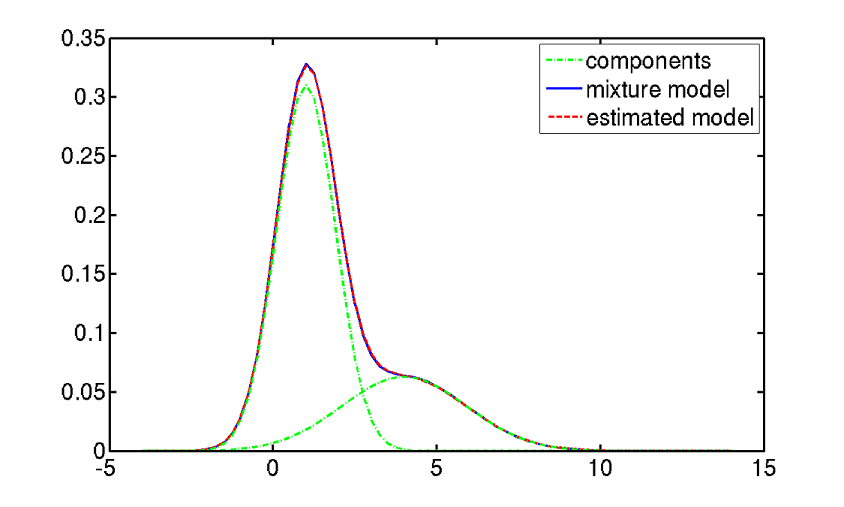

```{r setup, include=FALSE}
knitr::opts_chunk$set(echo = TRUE)
library(ggplot2)
library(gridExtra)
library(depmixS4)
library(grid)
```

```{r global_options, include=FALSE}
knitr::opts_chunk$set(fig.pos = 'h')
```

\section{Introduction}
In the time series context, when linear regression fails to model the data correctly or the stationary condition is violated, classical ARMA or ARIMA will not be suitable. These kinds of time series data can be modeled with HMM, along with several other modeling procedures. HMM is an unsupervised learning algorithm which helps to recognize underlying patterns in time series data. HMM is very useful for forecasting time series. This paper will examine the application of an HMM to financial time series data, for both a single stock market and allowing the potential correlations between stock markets to be measured and accounted for. We also provide the general theoretical framework of an HMM, as well as the assumptions of HMMs applied to financial time series data.

\section{Hidden Markov Model}
For a sequence $y_1,\dots,y_n$, a homogenous first-order Markov chain is defined as:
$$P\big(y_{n+1}=j|y_n=i_n,y_{n-1}=i_{n-1},\dots,y_1=i_1\big)=P\big(y_{n+1}=j|y_n=i\big)$$
Stated informally, the future depends on the past through the present. In some cases, we have an observable sequence $x_1,\dots,x_n$ with a finite possible number of observations $O={O_1,\dots,O_k}$ and the probabilities of seeing an observation at a given point in the sequence is dependent on an underlying (unobservable) sequence $y_1,\dots,y_n$ If the sequence $y_1  ,\dots,y_n$ is a homogenous first-order Markov chain, then the process involving both sequences can be described as a Hidden Markov model (HMM).

In addition to the parameters mentioned above, an HMM contains transition probabilities $t(i,j)$ initial state probabilities $pi(i)=p(y_1=i)$ and emission probabilities $e(x|i)$ Transition probabilities reflect the probability of being in state $j$ given that you were previously in state $i$ of the underlying Markov process. Initial state probabilities, as the name suggests, is the probability of being in state at the start of the observed Markov process. Emission probabilities are given as:
$$P\big(x_n=x|y_n=i,y_{n-1}, x_{n-1},\dots \big)=P\big(x_n=x|y_n=i\big)$$
where the assumption here is that the probability that $X$ takes a certain value today is dependent only on the current state of the underlying Markov process. The typical method for estimating the parameters above is the Expectation Maximization (EM) Algorithm. For more details on how EM is applied, please refer to `Zucchini et al. (2016)`.

\section{Financial Time Series Modeling Using HMM}
One of the interesting features of time series financial return data is the little to no autocorrelation that exists between observations. However, there is believed to be underlying states of stability and volatility that driver financial returns, and these states are theorized to follow a Markov process.

\section{Application to a Single Stock Market Index}
In case of the stock indices which track the day to day performance of the stock market in a given stock exchange. The terminology used is it is a bullish market when it goes up and it is a bearish market when there is a correction and prices start falling and continue falling. We look at the Indian market (SENSEX) as shown in Figure 1, and check for underlying Markov states in the different models.

```{r echo=FALSE,warning=FALSE,fig.height=3.3,fig.cap="Sensex close series from January 2000 to July 2017",out.extra='trim={0 1.5cm 0 1.5cm}'}
sensex <- read.csv("E:/R Workspace/Projects/Time series/sensex.csv")
plot(factor(sensex$Month,levels = sensex$Month),sensex$Close)
```

```{r warning=FALSE,echo=FALSE,include=FALSE}
n <- length(sensex$Close)
sen <- array()
for(i in 2:n){
  sen[i-1] <- log(sensex$Close[i]/sensex$Close[i-1])
}
sen <- as.data.frame(sen)
mod_sen_proper <- depmix(sen$sen ~ 1, nstates = 2, ntimes = 216)
fit_mod_sen_proper <- fit(mod_sen_proper)
summary(fit_mod_sen_proper)
esttrans <- posterior(fit_mod_sen_proper)
```

We considered the closure data from Sensex used the log difference i.e $\log\frac{x_t}{x_{t-1}}$ We try to estimate the transition of going from one Markov state to another viz. Bear to Bull or Bull to Bear as shown in Figure 2.

```{r echo=FALSE,fig.height=4,fig.cap="Sensex close price data from January 2000 to July 2017",out.extra='trim={0 0.5cm 0 0cm}',strip.white=TRUE}
par(mar=c(4, 4, 1, 1),mfrow=c(3,1))
plot(esttrans[,2],type="l",xlab="Tendency of being in Bull state (India)",ylab="Probability",axes=F)
axis(1, at = 1:length(sensex$Month), labels = sensex$Month)
axis(2, at=seq(0,1), labels=seq(0,1))

plot(esttrans[,3],type="l",xlab="Tendency of being in Bear State (India)",ylab="Probability",axes=F)
axis(1, at = 1:length(sensex$Month), labels = sensex$Month)
axis(2, at=seq(0,1), labels=seq(0,1))

plot(esttrans[,1]%%2+1,type="s",xlab="State transition (India)",ylab="States",axes=F)
axis(1, at = 1:length(sensex$Month), labels = sensex$Month)
axis(2, seq(1,2), labels=list("Bear","Bull"))
```

Transition matrix which gives the probability of switching states within bear and bull is

```{r echo=FALSE}
df <- data.frame('to Bull'=c(0.93,0.01),'to Bear' = c(0.07,0.99))
rownames(df) <- c('from Bull','from Bear')
knitr::kable(df,format = 'latex')
```

\section{Mixture model - HMM on BRICS stock indices}
We considered stock indices of emerging countries, BRICS: Brazil - B3 Sao Paulo, Russia - Moscow Stock Exchange, India - Bombay Stock Exchange, China - Shanghai Stock Exchange and South Africa - Johannesburg Stock Exchange. We fit HMM on each of them individually and motivation is to consider them all together as part of mixed model HMM. Mixed model is distribution f(x) is mixture of K component distributions
$$f(x)=\sum_{k=1}^K\pi_kg_k(x)$$
This mixture model is calculated using EM algorithm. If each of the components are gaussian, then mixture model is called gaussian mixture model. Figure 3 depicts basic gaussian mixture model having two gaussian components.



Before we fit gaussian mixture model on the combined data of five countries, we use qq-plot to check the normality of log differences of each countries.

```{r echo=FALSE,fig.height=3.6,fig.align='center',fig.cap="Checking normality of log differences of close prices BRICS stock market indicies"}
qqplot.data <- function (vec) # argument: vector of numbers
{
  # following four lines from base R's qqline()
  y <- quantile(vec[!is.na(vec)], c(0.25, 0.75))
  x <- qnorm(c(0.25, 0.75))
  slope <- diff(y)/diff(x)
  int <- y[1L] - slope * x[1L]
  
  d <- data.frame(resids = vec)
  
  return(ggplot(d, aes(sample = resids)) + stat_qq() + geom_abline(slope = slope, intercept = int))
  
}

grid.newpage()
vplayout <- function(x, y) viewport(layout.pos.row = x, layout.pos.col = y)
pushViewport(viewport(layout = grid.layout(2,5)))

bovespa <- read.csv("E:/R Workspace/Projects/Time series/bovespa.csv")
moex <- read.csv("E:/R Workspace/Projects/Time series/moex.csv")
sse <- read.csv("E:/R Workspace/Projects/Time series/sse.csv")
jtopi <- read.csv("E:/R Workspace/Projects/Time series/jtopi.csv")
sensex <- read.csv("E:/R Workspace/Projects/Time series/sensex.csv")

n <- length(jtopi$Close)
#Brazil
bovespa_ld <- log(bovespa$Close[-1]/bovespa$Close[-n])
bovespa_ld <- data.frame(bovespa_ld = bovespa_ld)
plotobj1 <- ggplot(bovespa_ld, aes(x = bovespa_ld)) + 
  geom_histogram(aes(y =..density..),binwidth = 0.015,
                 colour = "white", 
                 fill = "grey") + theme_bw()+
  labs(x = "Log returns",title = "Brazil") +
  stat_function(fun = dnorm, args = list(mean = mean(bovespa_ld$bovespa_ld),
                                         sd = sd(bovespa_ld$bovespa_ld)))
print(plotobj1, vp=vplayout(1,1))
plotobj2 <- qqplot.data(bovespa_ld$bovespa_ld) 
print(plotobj2, vp=vplayout(2,1))
#Russia
moex_ld <- log(moex$Close[-1]/moex$Close[-n])
moex_ld <- data.frame(moex_ld = moex_ld)
plotobj3 <- ggplot(moex_ld, aes(x = moex_ld)) + 
  geom_histogram(aes(y =..density..),binwidth = 0.02,
                 colour = "white", 
                 fill = "grey") +theme_bw()+
  labs(x = "Log returns",title = "Russia") +
  stat_function(fun = dnorm, args = list(mean = mean(moex_ld$moex_ld),
                                         sd = sd(moex_ld$moex_ld)))
print(plotobj3, vp=vplayout(1,2))
plotobj4 <- qqplot.data(moex_ld$moex_ld) 
print(plotobj4, vp=vplayout(2,2))
#India
sensex_ld <- log(sensex$Close[-1]/sensex$Close[-n])
sensex_ld <- data.frame(sensex_ld = sensex_ld)
plotobj5 <- ggplot(sensex_ld, aes(x = sensex_ld)) + 
            geom_histogram(aes(y =..density..),binwidth = 0.02,
            colour = "white", 
            fill = "grey") +theme_bw()+
  labs(x = "Log returns",title = "India") +
            stat_function(fun = dnorm, args = list(mean = mean(sensex_ld$sensex_ld),
                                                   sd = sd(sensex_ld$sensex_ld)))
print(plotobj5, vp=vplayout(1,3))
plotobj6 <- qqplot.data(sensex_ld$sensex_ld) 
print(plotobj6, vp=vplayout(2,3))

#China
sse_ld <- log(sse$Close[-1]/sse$Close[-n])
sse_ld <- data.frame(sse_ld = sse_ld)
plotobj7 <- ggplot(sse_ld, aes(x = sse_ld)) + 
  geom_histogram(aes(y =..density..),binwidth = 0.02,
                 colour = "white", 
                 fill = "grey") +
  labs(x = "Log returns",title = "China") +theme_bw()+
  stat_function(fun = dnorm, args = list(mean = mean(sse_ld$sse_ld),
                                         sd = sd(sse_ld$sse_ld)))
print(plotobj7, vp=vplayout(1,4))
plotobj8 <- qqplot.data(sse_ld$sse_ld) 
print(plotobj8, vp=vplayout(2,4))


#South Africa
jtopi_ld <- log(jtopi$Close[-1]/jtopi$Close[-n])
jtopi_ld <- data.frame(jtopi_ld = jtopi_ld)
plotobj9 <- ggplot(jtopi_ld, aes(x = jtopi_ld)) + 
  geom_histogram(aes(y =..density..),binwidth = 0.01,
                 colour = "white", 
                 fill = "grey") +theme_bw()+
  labs(x = "Log returns",title = "South Africa`") +
  stat_function(fun = dnorm, args = list(mean = mean(jtopi_ld$jtopi_ld),
                                         sd = sd(jtopi_ld$jtopi_ld)))
print(plotobj9, vp=vplayout(1,5))
plotobj10 <- qqplot.data(jtopi_ld$jtopi_ld) 
print(plotobj10, vp=vplayout(2,5))
```
From Figure 4, it can be verified that log differences of all BRICS indicies are normal. And hence we proceed for gaussian mixture model.

```{r echo=FALSE,include=FALSE}
bov <- array()
for(i in 2:n){
  bov[i-1] <- log(bovespa$Close[i]/bovespa$Close[i-1])
}
bov <- as.data.frame(bov)
moe <- array()
for(i in 2:n){
  moe[i-1] <- log(moex$Close[i]/moex$Close[i-1])
}
moe <- as.data.frame(moe)
sen <- array()
for(i in 2:n){
  sen[i-1] <- log(sensex$Close[i]/sensex$Close[i-1])
}
sen <- as.data.frame(sen)
ss <- array()
for(i in 2:n){
  ss[i-1] <- log(sse$Close[i]/sse$Close[i-1])
}
ss <- as.data.frame(ss)
jto <- array()
for(i in 2:n){
  jto[i-1] <- log(jtopi$Close[i]/jtopi$Close[i-1])
}
jto <- as.data.frame(jto)
df <- data.frame(bov,moe,sen,ss,jto)
mod <- depmix(list(bov~1,moe~1,sen~1,ss~1,jto~1),
              data=df,nstates=2,
              family=list(gaussian(),gaussian(),gaussian(),gaussian(),gaussian()),
              ntimes=c(216))
fit_mod_proper <- fit(mod,verbose=T)
s <- summary(fit_mod_proper)
esttrans <- posterior(fit_mod_proper)
```
Figure 5 indicates the state transition diagrams of mixed models.

```{r fig.height=4,echo=FALSE,fig.align='center',fig.cap="State transition diagrams for mixed model"}
par(mfrow=c(3,1),mar = c(4,2,1,0))

plot(esttrans[,2],type="l",xlab="Tendency of being in Bull state (Mixed Model)",ylab="Probability",axes=F)
axis(1, at = 1:length(jtopi$Month), labels = jtopi$Month)
axis(2, at=seq(0,1), labels=seq(0,1))

plot(esttrans[,3],type="l",xlab="Tendency of being in Bear State (Mixed Model)",ylab="Probability",axes=F)
axis(1, at = 1:length(jtopi$Month), labels = jtopi$Month)
axis(2, at=seq(0,1), labels=seq(0,1))

plot(esttrans[,1]%%2+1,type="s",xlab="State transition (Mixed Model)",ylab="States",axes=F)
axis(1, at = 1:length(jtopi$Month), labels = jtopi$Month)
axis(2, seq(1,2), labels=list("Bear","Bull"))
```

Below is the transition matrix obtained for 2-state HMM on mixed model.

```{r echo=FALSE}
df <- data.frame('to Bull'=c(0.718,0.585),'to Bear' = c(0.282,0.415))
rownames(df) <- c('from Bull','from Bear')
knitr::kable(df,format = 'latex')
```

\section{References}
1. Zucchini, W., MacDonald, I., Langrock, R. (2016). Hidden Markov Models for Time Series. CRC Press.

2. https://cran.r-project.org/web/packages/depmixS4/vignettes/depmixS4.pdf

